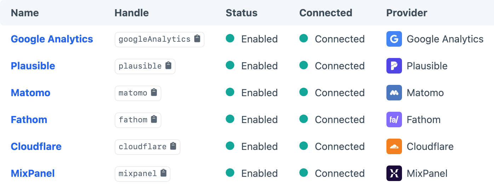

# Sources

Sources connect Metrix to analytics providers. Create them under **Metrix → Sources**, then pick a Source when configuring each widget.

You can mix Sources from different providers on the same dashboard. OAuth providers (such as Google Analytics) use a Connect handshake; others use API keys or client credentials you paste into the Source settings.

If a Source shows as **Not Connected** after tokens expire, reconnect from the Sources screen — widgets will surface a reconnect message instead of a raw API error.

Choose the matching setup page in **Providers** before entering credentials. For example, [Google Analytics](docs:providers/google-analytics) explains how to authorise a Google account, while [Plausible](docs:providers/plausible) explains its API-key and team-access requirements.

## Provider Capabilities

Not every provider supports every widget feature:

| Provider | Realtime | Dimensions (table/pie) | View analytics scope | Auth |
|---|---|---|---|---|
| Google Analytics | Yes | Yes | Yes | OAuth |
| Plausible | Yes | Yes | Yes (path) | API key |
| Matomo | — | Yes | Yes | Credentials |
| Fathom | Yes | Yes | — | Credentials |
| Umami | Yes | Yes | — | Credentials |
| Pirsch | Yes | Yes | — | Credentials |
| Cloudflare | — | Yes | — | Credentials |
| Goat Counter | — | Yes | — | Credentials |
| Simple Analytics | — | Yes | — | Credentials |
| Mixpanel | — | No | — | Credentials |

To display live activity, choose a Realtime widget and a Source marked **Yes** in the Realtime column. View scope is configured on the [View](docs:feature-tour/dashboard#multi-site-analytics-scope); unsupported Sources ignore it.
