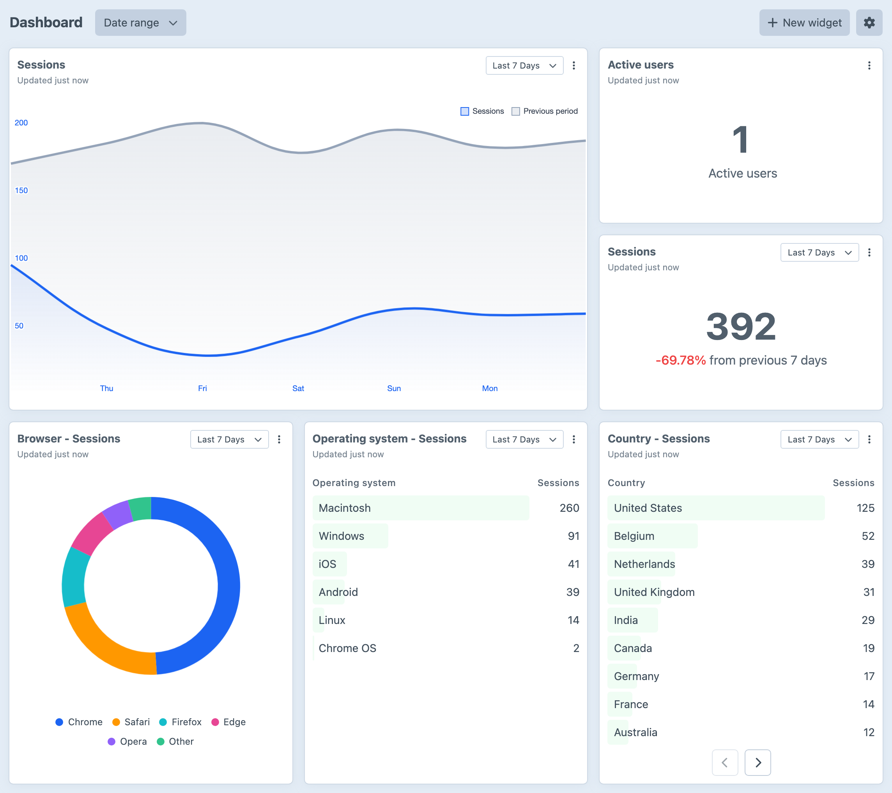
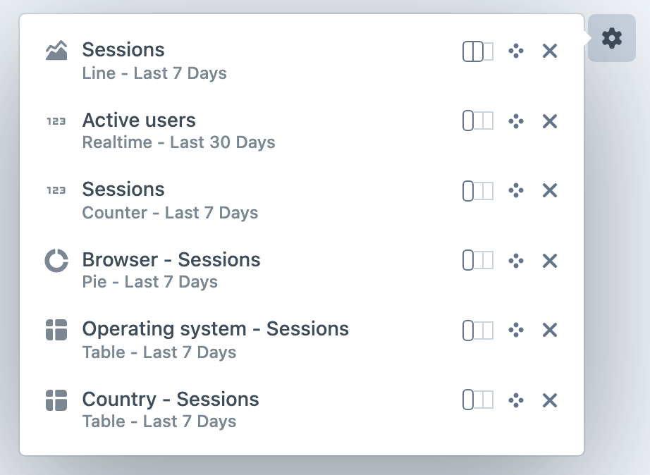
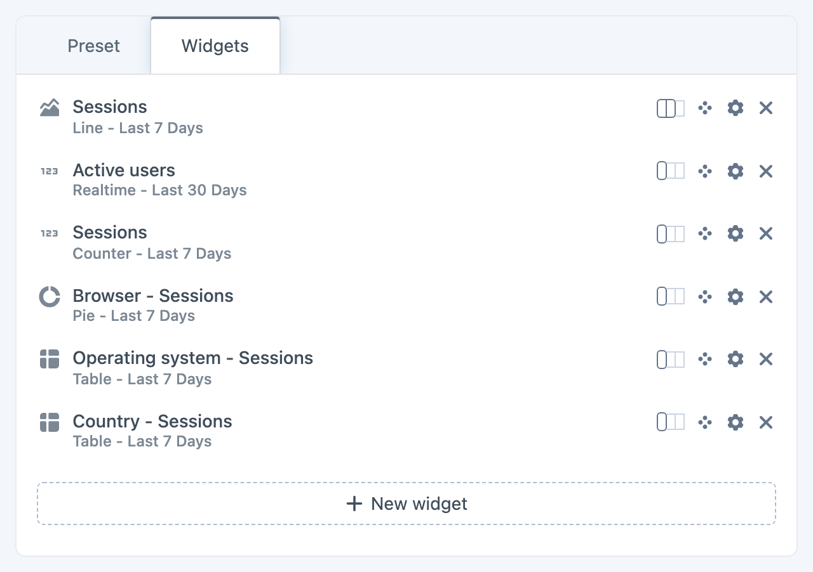

<!-- feature-intro -->
Display the analytics your team watches inside Craft. Combine supported sources, arrange useful widgets and give editors the numbers they need without sending them to another dashboard.
<!-- feature-intro-end -->

<!-- feature-section media-size="large" -->
## Dedicated analytics dashboards

Create dedicated views for your analytics data and tailor them to the team. Mix counters, charts, realtime panels and tables, use permissions to decide who sees each dashboard, and compare current results with the previous period without leaving Craft.

<!-- feature-section-end -->

<!-- feature-media media-size="medium" -->
## Arrange it your way

Resize and reorder widgets from the dashboard itself, or let selected widgets follow one shared date range. Each widget keeps its own source, chart type, metric and presentation settings, so the view can stay focused on the questions that matter to its audience.

<!-- feature-media-end -->

<!-- feature-section media-size="large" -->
## Bring analytics together

Connect Cloudflare Analytics, Fathom, GoatCounter, Google Analytics, Matomo, Mixpanel, Pirsch, Plausible, Simple Analytics or Umami, then mix their widgets within the same view. Common metrics and dimensions keep dashboards and presets useful across providers.

<!-- feature-section-end -->

<!-- feature-section media-size="medium" -->
## Reuse a proven setup

Save a useful collection of widgets as a project-configured preset and add it to another dashboard in a click. Presets keep repeatable reporting views consistent without locking the resulting dashboard in place.

<!-- feature-section-end -->
