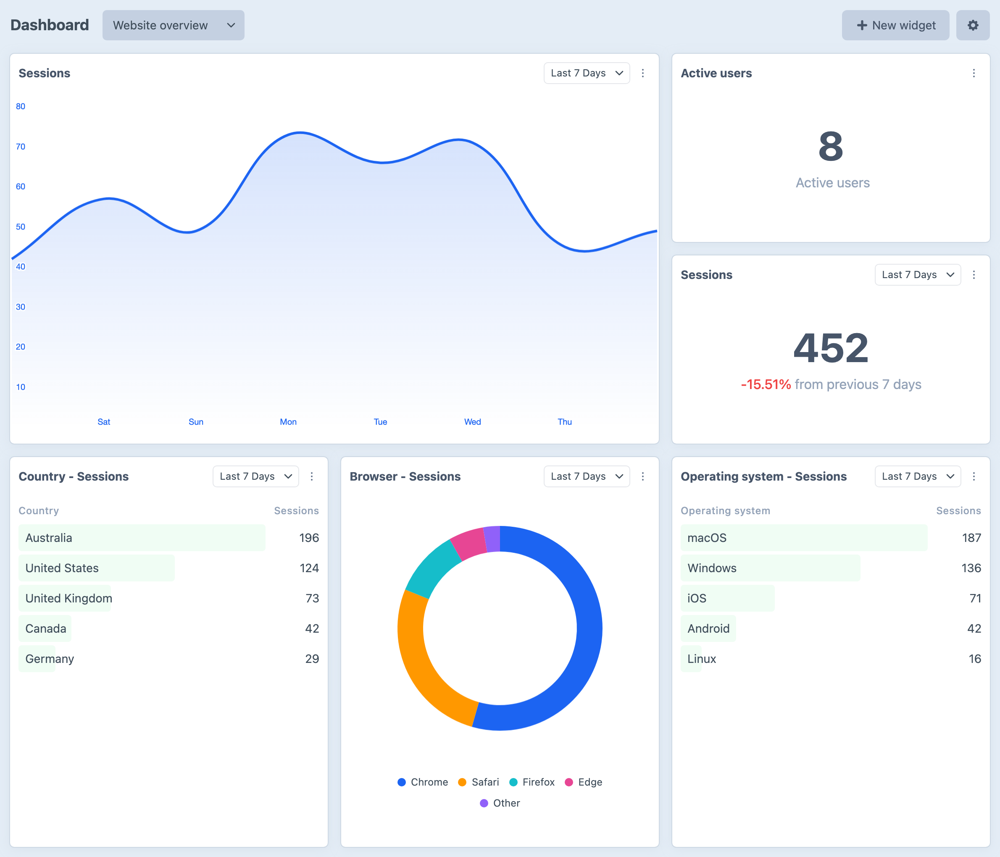
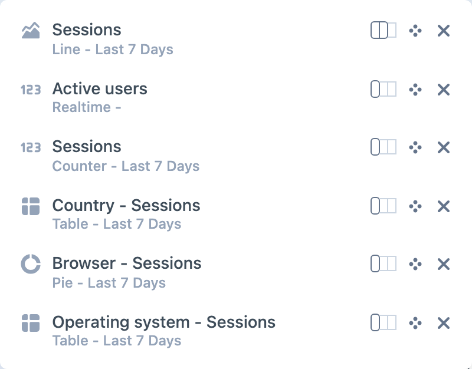
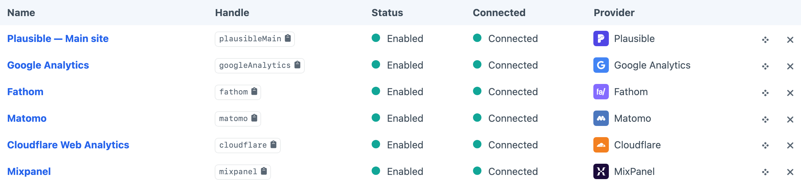
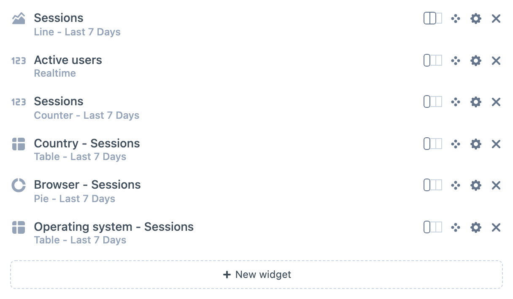

<!-- feature-intro -->
Display the analytics your team watches inside Craft. Combine supported sources, arrange useful widgets and give editors the numbers they need without sending them to another dashboard.
<!-- feature-intro-end -->

<!-- feature-section media-size="large" -->
## Dedicated analytics dashboards

Create dedicated views for your analytics data and tailor them to the team. Mix counters, charts, realtime panels and tables, then use permissions to decide who sees each dashboard.

<!-- feature-section-end -->

<!-- feature-media media-size="small" -->
## Arrange it your way

Resize and reorder widgets from the dashboard itself. Each widget keeps its own source, chart type, period and metric settings, so the view can stay focused on the questions that matter to its audience.

<!-- feature-media-end -->

<!-- feature-section media-size="large" -->
## Bring analytics together

Connect supported services including [Google Analytics](https://marketingplatform.google.com/about/analytics/), [Fathom](https://usefathom.com/), [Plausible](https://plausible.io/), [Matomo](https://matomo.org/), [Mixpanel](https://mixpanel.com/) and [Cloudflare Web Analytics](https://www.cloudflare.com/web-analytics/), then mix their widgets within the same view.

<!-- feature-section-end -->

<!-- feature-section media-size="medium" -->
## Reuse a proven setup

Save a useful collection of widgets as a project-configured preset and add it to another dashboard in a click. Presets keep repeatable reporting views consistent without locking the resulting dashboard in place.

<!-- feature-section-end -->
